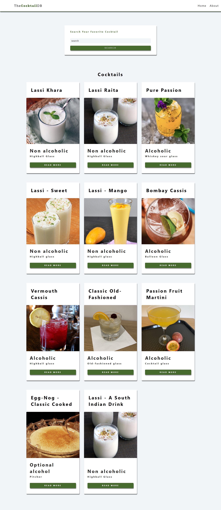
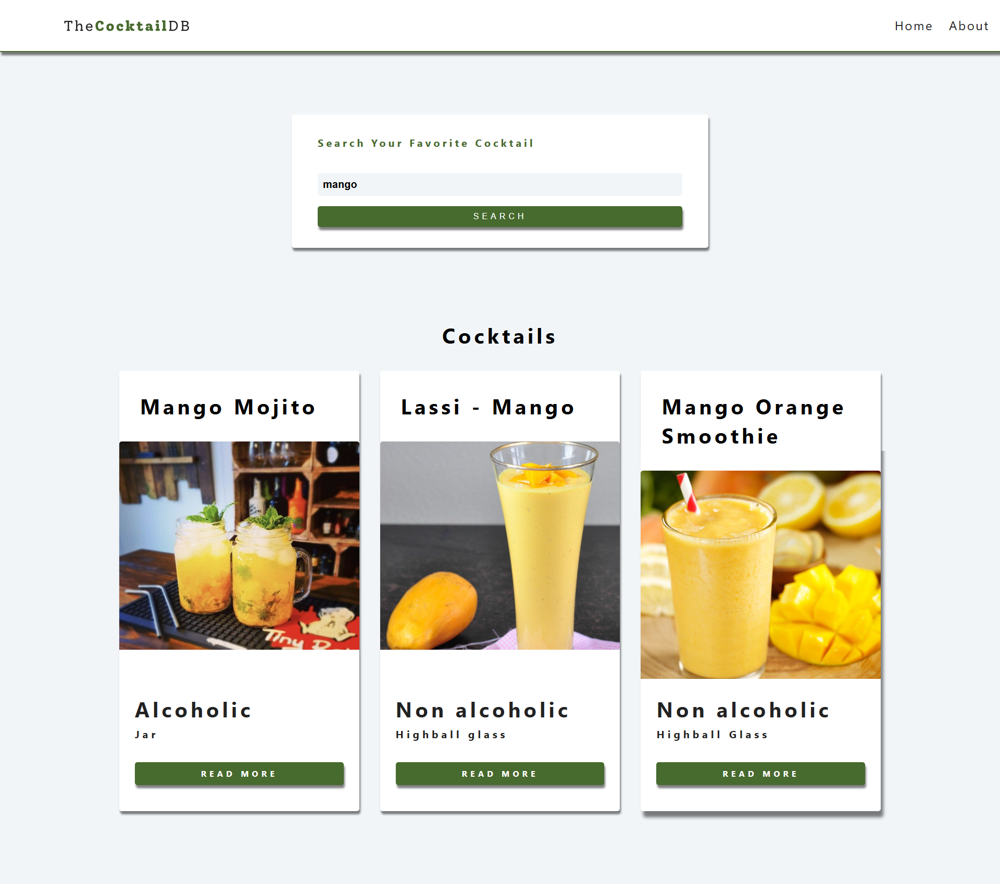
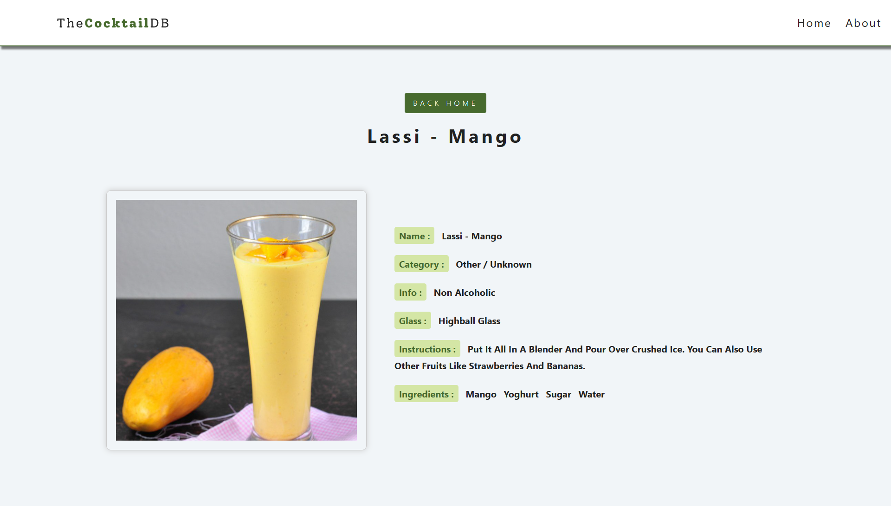
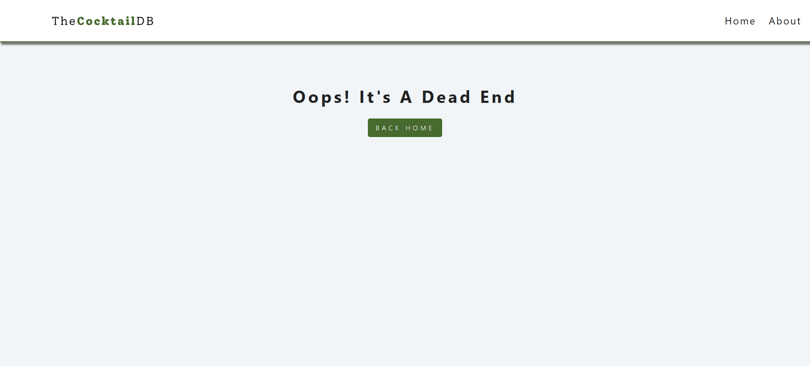
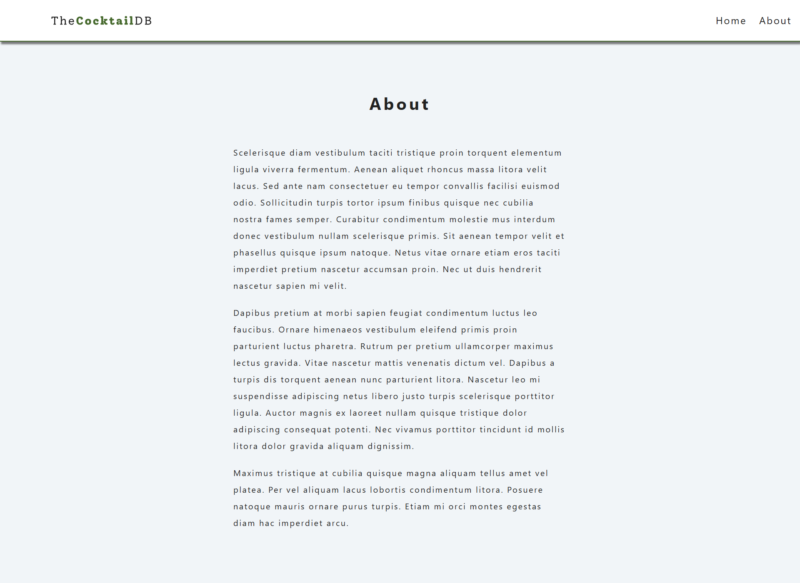

# React Cocktails

A simple React application that displays a list of cocktails and allows users to search for specific cocktails by name.

## Screens

| Page | Preview |
| :--- | :--- |
| **Home Page** |  |
| **Search Results** |  |
| **Cocktail Details** |  |
| **Error Page** |  |
| **About Page** |  |

---

## Features

- **Search Functionality:** Quickly find cocktails by name using the search bar.
- **Cocktail List:** Browse a collection of cocktails with high-quality images.
- **Detailed View:** Get comprehensive information about each drink, including ingredients, measurements, and preparation instructions.
- **Responsive Design:** Fully optimized for desktops, tablets, and mobile devices.
- **Error Handling:** Custom 404 page for non-existent routes and feedback for failed searches.
- **Dynamic Routing:** Seamless navigation between pages using React Router.

## Technologies Used

- **React:** Frontend library for building user interfaces.
- **React Router:** For handling client-side routing.
- **Axios:** For making API requests.
- **CSS Modules / Styled Components:** For component-level styling.
- **TheCocktailDB API:** Source for cocktail data.
